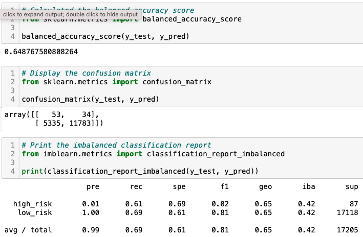
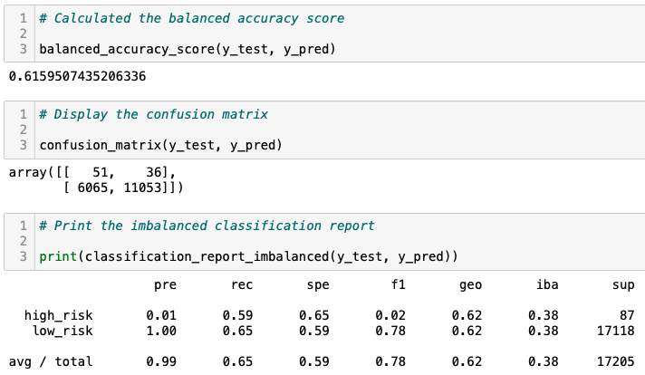

# Credit Risk Analysis

***University of Toronto - Data Analytics Boot Camp - Module 18 - Supervised Machine Learning and Credit Risk***

---

## Overview

We are using Supervised Machine Learning to predict credit risk and distinguish good and bad loans. There are serveral input variables and one binary output variable which is "loan_status" with possible outcomes of "low_risk" and "high_risk".
Logically, there are many more low risk applicants than the high risk ones. Therefore, the dataset is imbalanced and we should tackle this issue with a proper solution. Here in this project, we are using the resampling method to balance the datasets. We are also using two classification model to cop with bias.
We will create six different models with the following approaches.

    1. Naive Random oversampling
    2. SMOTE oversampling
    3. Cluster Centriod undersamling
    4. SMOTEENN (Combination of oversampling and undersamling)
    5. BalancedRandomForestClassifier model
    6. EasyEnsembleClassifier model
    
---

## Result

For all 6 models, we have executed different evaluation methods including Accuracy score, Confusion Matrix, and Classification Report.
Here we can review the evaluation results for all six models.

---

### Model 1 - Naive Random oversampling

* Accuracy score: ***0.65***
* Precision: ***0.01***
* Recall (Sensitivity): ***0.61***
* F1 Score: ***0.02***

---

### Model 2 - SMOTE oversampling

* Accuracy score: ***0.62***
* Precision: ***0.01***
* Recall (Sensitivity): ***0.59***
* F1 Score: ***0.02***

---

### Model 3 - Cluster Centriod undersamling

* Accuracy score: ***0.52***
* Precision: ***0.01***
* Recall (Sensitivity): ***0.60***
* F1 Score: ***0.01***

---

### Model 4 - SMOTEENN (Combination of oversampling and undersamling)

* Accuracy score: ***0.64***
* Precision: ***0.01***
* Recall (Sensitivity): ***0.70***
* F1 Score: ***0.02***

---

### Model 5 - BalancedRandomForestClassifier model

* Accuracy score: ***0.91***
* Precision: ***0.04***
* Recall (Sensitivity): ***0.67***
* F1 Score: ***0.07***

---

### Model 6 - EasyEnsembleClassifier model

* Accuracy score: ***0.94***
* Precision: ***0.07***
* Recall (Sensitivity): ***0.91***
* F1 Score: ***0.14***

---

## Summary

Which criteria can be most beneficial for us? The aim is detecting potential high risk loans. It is more important than detecting potential low risk loans since eventually we cannot lend money to all low risk candidates. In other word, considering high risk applicants, we wish to get higher level of True Positive (TP) compared to Actually Positive (TP + FN). This means the most important facotr is recall for high risk loan applications.

Although there are several models with high Accuracy score and acceptable recall, we wish to select the best model here. The model number 6 is the best model since it can give us a recall of 91% which means we can detect 9 out of 10 potential high risk loan which is great.
It is worth mentioning that the precision in this mdoel is very low and it can reject many applications which are actually low risk ones. If the number is acceptable according to our resources (How many applications we are willing to approve?), the ***6th model: EasyEnsembleClassifier*** is the best one.
